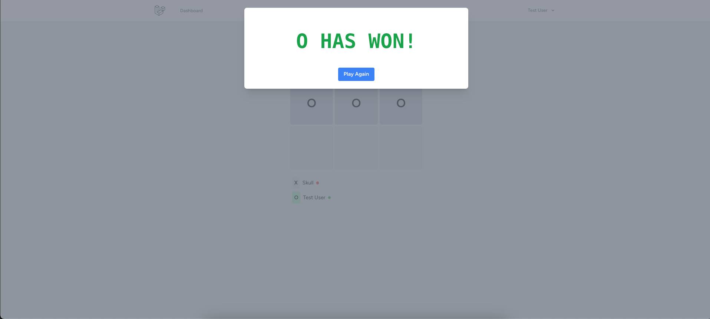

# Tic-Tac-Toe Multiplayer

#### This is a simple Tic Tac Toe game. Created for fun using Laravel, Vue and Reverb Websocket. The game has 3 types of states: "X" Wins, "O" Wins and Stalemate.

### Demo Test
* [Demo Site](http://ttt.webzow.com/register)
* Register your free account.
* Create or Join a game.

### Screenshots



---
## Project Features
* Laravel 11x.
* Laravel Reverb
* Vue3

---
## Install

- Copy .env.example file to .env
- Edit .env file and set your database and reverb connection details

```bash
composer install
npm install
npm run build
php artisan key:generate
```

### Run workers and websockets

```bash
 php artisan queue:work
 php artisan reverb:start --host=YOUR_SERVER_IP --hostname=YOUR_DOMAIN --port=8087
```

+ Change YOUR_SERVER_IP for your Host IP.
+ Change YOUR_DOMAIN for your domain.

### For PM2 process background

```bash
pm2 start "php artisan reverb:start --host=77.37.69.219 --hostname=ttt.webzow.com --port=8087" --name ttt_websocket
pm2 start "php artisan queue:work" --name ttt_worker
pm2 save
pm2 startup
```
